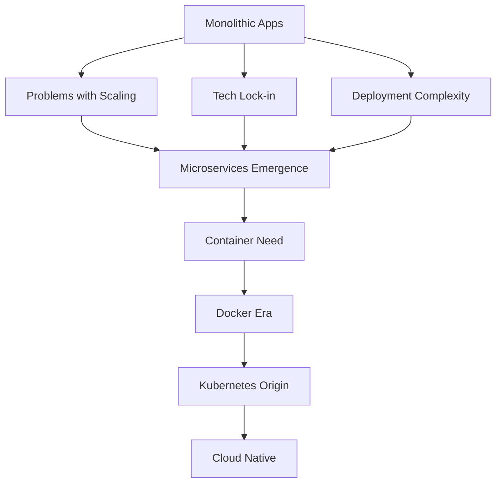

# Chapter 1: History of Cloud Native Applications

## The Evolution from Monolithic to Microservices

The journey to Kubernetes began with traditional monolithic applications. In the early days of software development, applications were built as single, large units. These monolithic applications contained all the business logic, user interface, and data access code in one place.

### Monolithic Architecture

A monolithic application is like a single building where all departments (user interface, business logic, database access) are housed together. While this approach worked well for simple applications, it had several limitations:

- **Scaling challenges**: The entire application needed to be scaled even if only one component required more resources
- **Technology lock-in**: The entire application had to use the same technology stack
- **Deployment complexity**: A small change required redeploying the entire application
- **Development bottlenecks**: Different teams had to coordinate extensively to avoid conflicts

### Rise of Microservices

As applications grew more complex, developers began to realize that breaking large applications into smaller, independent services could solve many of these problems. This approach, known as microservices architecture, treats each component as a separate, independently deployable service.

Microservices offered several advantages:
- **Independent scaling**: Each service could be scaled based on its specific needs
- **Technology flexibility**: Different services could use different technology stacks
- **Easier maintenance**: Smaller codebases were easier to understand and modify
- **Fault isolation**: A failure in one service wouldn't necessarily bring down the entire application

## Rise of Containers

While microservices solved many architectural challenges, they introduced new ones. How do you deploy, manage, and connect dozens or hundreds of small services? This is where containers came into the picture.

### What Are Containers?

Containers are lightweight, standalone packages that include everything needed to run a piece of software: code, runtime, system tools, libraries, and settings. Think of them as shipping containers for software—standardized, portable, and efficient.

Docker, released in 2013, made containerization accessible to a broader audience. It simplified the process of creating, deploying, and managing containers, leading to widespread adoption.

### Benefits of Containers

- **Consistency**: Applications run the same way regardless of where they're deployed
- **Efficiency**: Containers share the host OS kernel, making them more lightweight than virtual machines
- **Portability**: Containers can run on any system that supports the container runtime
- **Fast startup**: Containers start much faster than traditional virtual machines

## Kubernetes Origin: Google Borg to Open-Source

### Google Borg: The Precursor

Before Kubernetes, Google was already managing large-scale containerized applications internally. Their system, called Borg, was developed in 2003 and managed millions of jobs across thousands of machines. Borg provided the foundation for many concepts that would later appear in Kubernetes:

- Container orchestration at scale
- Service discovery and load balancing
- Automated scheduling and placement
- Health monitoring and self-healing

### Birth of Kubernetes

In 2014, Google open-sourced Kubernetes (Greek for "helmsman" or "pilot") as a way to share their container orchestration expertise with the world. Kubernetes was designed to automate deployment, scaling, and management of containerized applications.

### Key Milestones

- **2014**: Kubernetes open-sourced by Google
- **2015**: Kubernetes donated to Cloud Native Computing Foundation (CNCF)
- **2017**: Kubernetes 1.0 released with major enterprise features
- **2018**: Kubernetes graduates from CNCF as the foundation's first graduated project

## The Cloud Native Landscape

Kubernetes became the cornerstone of the cloud-native ecosystem. The Cloud Native Computing Foundation (CNCF) defines cloud-native computing as:

> "Cloud native technologies empower organizations to build and run scalable applications in modern, dynamic environments such as public, private, and hybrid clouds. Containers, service meshes, microservices, immutable infrastructure, and declarative APIs exemplify this approach."

### The CNCF Landscape

The CNCF landscape includes hundreds of projects that complement Kubernetes, including:
- **Prometheus** for monitoring
- **Envoy** for service mesh
- **Jaeger** for distributed tracing
- **CoreDNS** for service discovery

## Summary

In this chapter, we've explored the journey from monolithic applications to the cloud-native ecosystem powered by Kubernetes. Understanding this history helps us appreciate why Kubernetes exists and the problems it solves. In the next chapter, we'll dive into what Kubernetes is, why it's needed, and how it works.

### Quiz

1. What is the main difference between monolithic and microservices architectures?
2. Name three benefits of containerization.
3. What was the predecessor to Kubernetes developed by Google?

