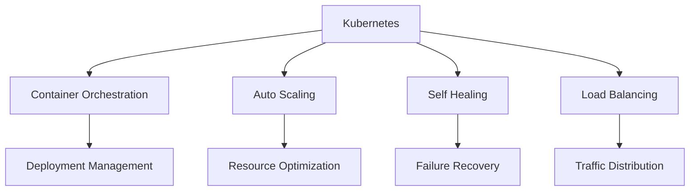

# Chapter 2: What, Why, Need, and How of Kubernetes

## What is Kubernetes?

Kubernetes, often abbreviated as K8s, is an open-source container orchestration platform that automates the deployment, scaling, and management of containerized applications. Think of it as an operating system for your cluster of machines, abstracting the underlying infrastructure and providing a unified way to run distributed applications.

Kubernetes was originally designed by Google and is now maintained by the Cloud Native Computing Foundation (CNCF). It builds on over 15 years of experience running production workloads at Google, combined with best-of-breed ideas from the community.

## Why Do We Need Kubernetes?

### The Challenge of Container Management

While containers solved many problems related to application packaging and deployment, managing them at scale introduced new challenges:

- **Orchestration**: How do you deploy containers across multiple machines?
- **Scaling**: How do you automatically scale applications up or down based on demand?
- **Networking**: How do containers communicate with each other and the outside world?
- **Storage**: How do you manage persistent data for stateful applications?
- **Health Monitoring**: How do you ensure applications are running properly?
- **Rolling Updates**: How do you update applications without downtime?

### Kubernetes Solutions

Kubernetes addresses these challenges by providing:

- **Automatic binpacking**: Efficiently utilizes hardware resources by scheduling containers based on resource requirements
- **Self-healing**: Automatically restarts failed containers, replaces containers when nodes die, and kills containers that don't respond to health checks
- **Horizontal scaling**: Scales applications up or down with a command, UI, or based on CPU usage
- **Service discovery and load balancing**: Uses DNS names or IP addresses to expose containers
- **Storage orchestration**: Automatically mounts storage systems of your choice
- **Secret and configuration management**: Deploys and updates secrets and application configuration without rebuilding images
- **Batch execution**: Supports batch and CI workloads, replacing failed containers if they terminate
- **Rolling updates**: Gradually deploys changes to applications without downtime

## Real-World Use Cases

### E-commerce Platform

An online retailer uses Kubernetes to handle traffic spikes during holiday seasons. Kubernetes automatically scales the application up during peak hours and scales it down during off-peak hours, optimizing resource usage and cost.

### Financial Services

A financial institution uses Kubernetes to deploy microservices that handle different aspects of their platform: user authentication, transaction processing, and reporting. Each service can be developed, deployed, and scaled independently.

### Media Streaming

A media company uses Kubernetes to manage their video streaming platform. Kubernetes handles load balancing across multiple instances of their application, ensuring smooth streaming for millions of users.

## High-Level Architecture Overview

Kubernetes follows a master-worker architecture with the following key components:

### Control Plane Components

- **API Server**: The front end for the Kubernetes control plane that exposes the Kubernetes API
- **etcd**: A consistent and highly-available key-value store used as Kubernetes' backing store for all cluster data
- **Scheduler**: Watches for newly created Pods with no assigned node, and selects a node for them to run on
- **Controller Manager**: Runs controller processes that regulate the state of the cluster
- **Cloud Controller Manager**: Interacts with the underlying cloud provider's API

### Node Components

- **kubelet**: An agent that runs on each node in the cluster, ensuring containers are running in a Pod
- **kube-proxy**: A network proxy that runs on each node, maintaining network rules for network communication
- **Container Runtime**: Software responsible for running containers (Docker, containerd, CRI-O, etc.)

### Add-ons

- **DNS**: Cluster DNS server for service discovery
- **Web UI (Dashboard)**: A general-purpose web-based UI for Kubernetes clusters
- **Container Resource Monitoring**: Collects and stores metrics
- **Cluster-level Logging**: Stores and searches log files

## Basic Workflow

The typical Kubernetes workflow involves:

1. **Define**: Create a configuration file (YAML) that describes the desired state of your application
2. **Deploy**: Use `kubectl` (Kubernetes command-line tool) to send the configuration to the API server
3. **Schedule**: The scheduler assigns Pods to Nodes based on resource requirements and constraints
4. **Run**: The kubelet on each node ensures the containers are running as expected
5. **Monitor**: Kubernetes continuously monitors the state and takes corrective actions if needed

## Key Concepts

- **Pod**: The smallest deployable unit in Kubernetes, which can contain one or more containers
- **Service**: An abstraction that defines a logical set of Pods and a policy to access them
- **Deployment**: A controller that provides declarative updates for Pods and ReplicaSets
- **Namespace**: A way to divide cluster resources between multiple users

## Summary

Kubernetes solves the complex problem of container orchestration by providing a platform for automating deployment, scaling, and operations of application containers. It's essential for organizations running containerized applications at scale, providing reliability, scalability, and portability.

In the next chapter, we'll set up your first Kubernetes environment using free tools.

### Quiz

1. What does K8s stand for?
2. Name three benefits of using Kubernetes for container orchestration.
3. What is the smallest deployable unit in Kubernetes?

