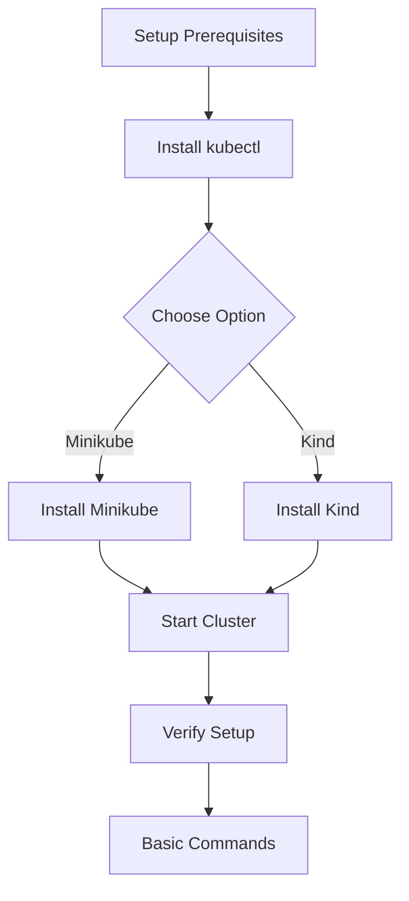

# Chapter 3: Setting Up Your First Kubernetes Environment

## Overview

In this chapter, we'll set up your first Kubernetes environment using free tools. We'll cover two popular options: Minikube for a local single-node cluster and Kind (Kubernetes in Docker) as an alternative. Both are perfect for learning and development purposes.

## Prerequisites

Before we begin, ensure you have:

- **Docker** installed on your system (Docker Desktop for Mac/Windows or Docker Engine for Linux)
- **kubectl** - the Kubernetes command-line tool
- **A terminal** (Command Prompt, PowerShell, or Terminal)

## Installing kubectl

kubectl is the command-line tool for interacting with Kubernetes clusters. Let's install it first:

### On macOS
```bash
# Using Homebrew
brew install kubectl

# Or using curl
curl -LO "https://dl.k8s.io/release/$(curl -L -s https://dl.k8s.io/release/stable.txt)/bin/darwin/amd64/kubectl"
chmod +x kubectl
sudo mv kubectl /usr/local/bin/
```

### On Windows
```bash
# Using Chocolatey
choco install kubernetes-cli

# Or using curl
curl -LO "https://dl.k8s.io/release/v1.29.0/bin/windows/amd64/kubectl.exe"
# Add kubectl to your PATH
```

### On Linux
```bash
curl -LO "https://dl.k8s.io/release/$(curl -L -s https://dl.k8s.io/release/stable.txt)/bin/linux/amd64/kubectl"
chmod +x kubectl
sudo mv kubectl /usr/local/bin/
```

Verify the installation:
```bash
kubectl version --client
```

## Option 1: Setting Up with Minikube

Minikube is a tool that runs a single-node Kubernetes cluster in a virtual machine on your personal computer. It's perfect for learning Kubernetes.

### Installation

#### On macOS
```bash
# Using Homebrew
brew install minikube

# Or using curl
curl -Lo minikube https://storage.googleapis.com/minikube/releases/latest/minikube-darwin-amd64
chmod +x minikube
sudo mv minikube /usr/local/bin
```

#### On Windows
```bash
# Using Chocolatey
choco install minikube

# Or using PowerShell
New-Item -Path 'c:\' -Name 'minikube' -ItemType Directory -Force
Invoke-WebRequest -OutFile 'c:\minikube\minikube.exe' -Uri 'https://github.com/kubernetes/minikube/releases/latest/download/minikube-windows-amd64.exe' -UseBasicParsing
```

#### On Linux
```bash
curl -Lo minikube https://storage.googleapis.com/minikube/releases/latest/minikube-linux-amd64
chmod +x minikube
sudo mv minikube /usr/local/bin
```

### Starting Minikube

1. Start your Minikube cluster:
```bash
minikube start
```

2. Verify that Minikube is running:
```bash
minikube status
```

3. Check that kubectl can connect to your cluster:
```bash
kubectl get nodes
```

You should see output showing one node in the cluster.

### Accessing the Dashboard

Minikube includes a web-based dashboard for Kubernetes:

```bash
minikube dashboard
```

This command will open the Kubernetes dashboard in your default browser.

## Option 2: Setting Up with Kind

Kind (Kubernetes in Docker) runs Kubernetes clusters using Docker containers as nodes. It's an excellent alternative to Minikube.

### Installation

#### Using Homebrew (macOS)
```bash
brew install kind
```

#### Using Chocolatey (Windows)
```bash
choco install kind
```

#### Using Snap (Linux)
```bash
sudo snap install kind --classic
```

#### Manual Installation (All Platforms)
Download the appropriate binary from the [Kind releases page](https://github.com/kubernetes-sigs/kind/releases) and add it to your PATH.

### Creating a Kind Cluster

1. Create a cluster:
```bash
kind create cluster
```

2. Verify the cluster is running:
```bash
kubectl cluster-info
```

3. Check the nodes:
```bash
kubectl get nodes
```

You should see a control-plane node.

### Using a Custom Configuration

You can also create a cluster with a custom configuration:

1. Create a configuration file named `kind-config.yaml`:
```yaml
kind: Cluster
apiVersion: kind.x-k8s.io/v1alpha4
nodes:
- role: control-plane
- role: worker
- role: worker
```

2. Create the cluster with your configuration:
```bash
kind create cluster --config kind-config.yaml
```

## Verifying Your Setup

Once you have either Minikube or Kind running, verify your setup with these commands:

1. Check cluster information:
```bash
kubectl cluster-info
```

2. List nodes:
```bash
kubectl get nodes
```

3. Create a test deployment:
```bash
kubectl create deployment nginx --image=nginx
```

4. Expose the deployment as a service:
```bash
kubectl expose deployment nginx --port=80 --type=NodePort
```

5. Check the deployment:
```bash
kubectl get deployments
kubectl get services
```

6. Clean up the test deployment:
```bash
kubectl delete deployment nginx
kubectl delete service nginx
```

## Troubleshooting Common Issues

### Docker Not Running
If you get an error about Docker, make sure Docker is running:
- On macOS/Windows: Start Docker Desktop
- On Linux: Start the Docker service with `sudo systemctl start docker`

### Insufficient Resources
If your cluster fails to start due to resource constraints:
- For Minikube: Try `minikube start --memory=2048 --cpus=2`
- For Kind: Ensure Docker has enough resources allocated

### Permission Issues
If you encounter permission issues with Docker:
- On Linux: Add your user to the docker group: `sudo usermod -aG docker $USER`
- Log out and log back in for changes to take effect

## Basic kubectl Commands

Here are some essential kubectl commands for getting started:

- `kubectl get pods` - List all pods in the default namespace
- `kubectl get services` - List all services in the default namespace
- `kubectl get deployments` - List all deployments in the default namespace
- `kubectl describe pod <pod-name>` - Get detailed information about a pod
- `kubectl logs <pod-name>` - View logs from a pod
- `kubectl delete pod <pod-name>` - Delete a pod

## Summary

In this chapter, we've successfully set up a Kubernetes environment using either Minikube or Kind. You now have a local Kubernetes cluster running and can interact with it using kubectl. This environment will be perfect for experimenting with the concepts we'll cover in the upcoming chapters.

In the next chapter, we'll dive into core Kubernetes concepts: Pods, Deployments, and Services.

### Quiz

1. What is the difference between Minikube and Kind?
2. Name three kubectl commands you learned in this chapter.
3. What does the command `kubectl get nodes` do?

