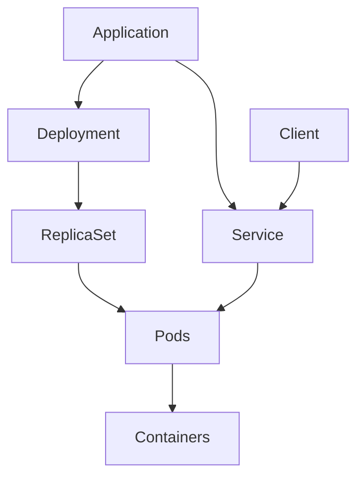

# Chapter 4: Core Kubernetes Concepts: Pods, Deployments, and Services

## Introduction

In this chapter, we'll explore the three fundamental building blocks of Kubernetes: Pods, Deployments, and Services. Understanding these concepts is crucial for working with Kubernetes effectively.

## Pods: The Smallest Unit

### What is a Pod?

A Pod is the smallest deployable unit in Kubernetes. It represents a single instance of a running process in your cluster. A Pod can contain one or more containers that share storage and network resources, and are always co-located and co-scheduled.

### Key Characteristics of Pods

- **Single Unit**: All containers in a Pod are managed as a single entity
- **Shared Resources**: Containers in a Pod share the same IP address, hostname, and storage volumes
- **Co-located**: All containers in a Pod run on the same node
- **Co-scheduled**: All containers in a Pod are created and destroyed together

### Creating a Pod

Here's a simple Pod definition in YAML:

```yaml
apiVersion: v1
kind: Pod
metadata:
  name: nginx-pod
  labels:
    app: nginx
spec:
  containers:
  - name: nginx-container
    image: nginx:latest
    ports:
    - containerPort: 80
```

### Pod Lifecycle

Pods have several phases:
- **Pending**: The Pod has been accepted but not all containers have been created
- **Running**: The Pod has been bound to a node and all containers have been created
- **Succeeded**: All containers in the Pod have terminated successfully
- **Failed**: At least one container has terminated with a failure
- **Unknown**: The state of the Pod could not be obtained

## Deployments: Desired State Management

### What is a Deployment?

A Deployment provides declarative updates for Pods and ReplicaSets. It allows you to define the desired state of your application, and Kubernetes will ensure that the actual state matches the desired state.

### Key Features of Deployments

- **Declarative Updates**: Define the desired state, and Kubernetes manages the transition
- **Rolling Updates**: Update applications without downtime
- **Rollback**: Roll back to previous versions if needed
- **Scaling**: Easily scale applications up or down

### Creating a Deployment

Here's a Deployment definition:

```yaml
apiVersion: apps/v1
kind: Deployment
metadata:
  name: nginx-deployment
spec:
  replicas: 3
  selector:
    matchLabels:
      app: nginx
  template:
    metadata:
      labels:
        app: nginx
    spec:
      containers:
      - name: nginx
        image: nginx:1.25.3
        ports:
        - containerPort: 80
```

### Deployment Commands

Common Deployment operations:
- `kubectl create deployment <name> --image=<image>` - Create a deployment
- `kubectl scale deployment <name> --replicas=<count>` - Scale a deployment
- `kubectl set image deployment/<name> <container>=<new-image>` - Update container image
- `kubectl rollout status deployment/<name>` - Check rollout status
- `kubectl rollout undo deployment/<name>` - Rollback to previous version

### ReplicaSets

Deployments manage ReplicaSets, which ensure a specified number of Pod replicas are running at any given time. While you can create ReplicaSets directly, Deployments are the recommended approach as they provide additional functionality like rolling updates.

## Services: Networking and Communication

### What is a Service?

A Service is an abstraction that defines a logical set of Pods and a policy to access them. Services enable communication between different application components, whether they're inside or outside the cluster.

### Service Types

Kubernetes supports several Service types:

1. **ClusterIP** (default): Exposes the Service on an internal IP within the cluster
2. **NodePort**: Exposes the Service on the same port of each selected Node using NAT
3. **LoadBalancer**: Creates an external load balancer in the cloud provider
4. **ExternalName**: Maps the Service to the contents of the externalName field

### Creating a Service

Here's a Service definition:

```yaml
apiVersion: v1
kind: Service
metadata:
  name: nginx-service
spec:
  selector:
    app: nginx
  ports:
    - protocol: TCP
      port: 80
      targetPort: 80
  type: ClusterIP
```

### Service Discovery

Services provide two primary methods of discovery:
- **Environment Variables**: Kubernetes adds environment variables for each Service
- **DNS**: Kubernetes DNS service provides DNS records for Services

## Relationship Between Pods, Deployments, and Services

### How They Work Together

1. **Deployments** manage the desired state and lifecycle of **Pods**
2. **Services** provide stable network endpoints to access **Pods**
3. **Deployments** ensure the correct number of **Pods** are running
4. **Services** route traffic to healthy **Pods** based on labels

### Example: Complete Application Setup

Here's how all three components work together:

```yaml
# Deployment
apiVersion: apps/v1
kind: Deployment
metadata:
  name: web-app
spec:
  replicas: 3
  selector:
    matchLabels:
      app: web-app
  template:
    metadata:
      labels:
        app: web-app
    spec:
      containers:
      - name: web-container
        image: nginx:latest
        ports:
        - containerPort: 80

---
# Service
apiVersion: v1
kind: Service
metadata:
  name: web-app-service
spec:
  selector:
    app: web-app
  ports:
    - protocol: TCP
      port: 80
      targetPort: 80
  type: LoadBalancer
```

## Labels and Selectors

### What are Labels?

Labels are key-value pairs that are attached to objects like Pods. They are used to organize and select subsets of objects.

### Example Labels
```yaml
metadata:
  labels:
    environment: production
    app: nginx
    version: "1.0"
```

### Selectors

Selectors are used by Services and Deployments to identify which Pods they should target. They match against the labels on Pods.

## Health Checks

Kubernetes provides two types of health checks:

1. **Liveness Probes**: Determines if a container is running properly
2. **Readiness Probes**: Determines if a container is ready to serve traffic

### Example Probes
```yaml
spec:
  containers:
  - name: nginx
    image: nginx:latest
    livenessProbe:
      httpGet:
        path: /
        port: 80
      initialDelaySeconds: 30
      periodSeconds: 10
    readinessProbe:
      httpGet:
        path: /
        port: 80
      initialDelaySeconds: 5
      periodSeconds: 5
```

## Practical Exercise

Let's create a simple application using all three concepts:

1. Create a Deployment with 2 replicas:
```bash
kubectl create deployment hello-app --image=gcr.io/google-samples/hello-app:1.0
kubectl scale deployment hello-app --replicas=2
```

2. Expose the Deployment as a Service:
```bash
kubectl expose deployment hello-app --port=8080 --target-port=8080 --type=NodePort
```

3. Check the created resources:
```bash
kubectl get pods
kubectl get deployments
kubectl get services
```

4. Access the application:
```bash
minikube service hello-app
```

## Summary

In this chapter, we've covered the three fundamental Kubernetes concepts:

- **Pods**: The smallest deployable unit, containing one or more containers
- **Deployments**: Manage the desired state of your applications with scaling and rolling updates
- **Services**: Provide stable network endpoints for accessing your applications

Understanding these concepts is crucial for working with Kubernetes effectively. In the next chapter, we'll explore how to develop and deploy cloud-native applications using these building blocks.

### Quiz

1. What is the smallest deployable unit in Kubernetes?
2. What is the difference between a Deployment and a ReplicaSet?
3. Name the four types of Services in Kubernetes.

