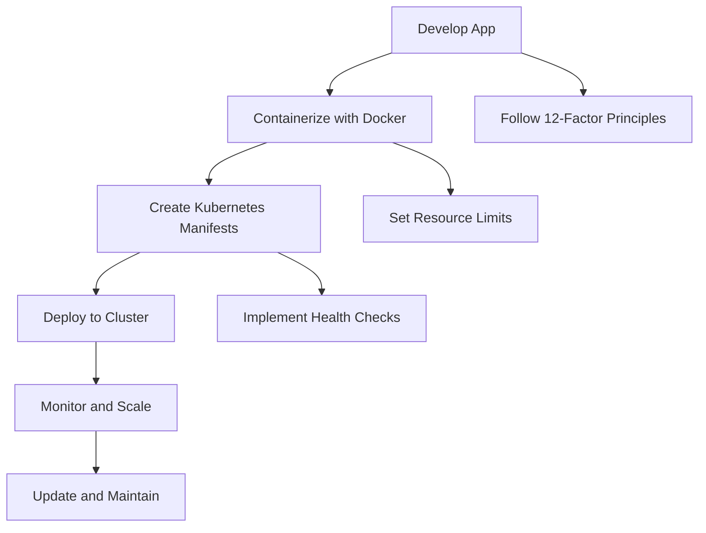

# Chapter 5: Developing and Deploying Cloud-Native Apps

## Introduction

In this chapter, we'll take a practical approach to developing and deploying a cloud-native application on Kubernetes. We'll walk through the complete process from containerizing a simple application to deploying it on our Kubernetes cluster.

## Overview of Cloud-Native Development

Cloud-native development involves designing applications that take full advantage of cloud computing models. Key principles include:

- **Microservices Architecture**: Breaking applications into smaller, independently deployable services
- **Containerization**: Packaging applications and dependencies into containers
- **Declarative APIs**: Using declarative configuration to manage infrastructure
- **Resilience**: Building applications that handle failures gracefully
- **Observability**: Implementing comprehensive logging, monitoring, and tracing

## Containerizing a Simple Application

### Sample Application: Hello World Node.js App

Let's create a simple Node.js application that we'll deploy to Kubernetes:

1. Create a new directory for our application:
```bash
mkdir hello-k8s-app
cd hello-k8s-app
```

2. Initialize a new Node.js project:
```bash
npm init -y
```

3. Create the main application file (`app.js`):
```javascript
const express = require('express');
const app = express();
const PORT = process.env.PORT || 8080;

app.get('/', (req, res) => {
  res.send(`
    <h1>Hello from Kubernetes!</h1>
    <p>This is a cloud-native application running on Kubernetes.</p>
  `);
});

app.get('/health', (req, res) => {
  res.status(200).send('OK');
});

app.listen(PORT, () => {
  console.log(`Server is running on port ${PORT}`);
});
```

4. Install Express:
```bash
npm install express
```

5. Create a `package.json` script for starting the app:
```json
{
  "scripts": {
    "start": "node app.js"
  }
}
```

### Creating a Dockerfile

Now, let's containerize our application by creating a Dockerfile:

```Dockerfile
# Use the official Node.js runtime as the base image
FROM node:18-alpine

# Set the working directory in the container
WORKDIR /app

# Copy package.json and package-lock.json to the working directory
COPY package*.json ./

# Install dependencies
RUN npm install

# Copy the rest of the application code to the working directory
COPY . .

# Expose port 8080 to allow communication to/from the application
EXPOSE 8080

# Define the command to run the application
CMD ["npm", "start"]
```

### Building the Docker Image

1. Build the Docker image:
```bash
docker build -t hello-k8s-app:v1.0 .
```

2. Test the image locally:
```bash
docker run -p 8080:8080 hello-k8s-app:v1.0
```

Visit `http://localhost:8080` to verify the application works.

## Kubernetes YAML Manifests

Now we'll create Kubernetes manifests to deploy our application.

### Deployment Manifest

Create `deployment.yaml`:

```yaml
apiVersion: apps/v1
kind: Deployment
metadata:
  name: hello-k8s-app
  labels:
    app: hello-k8s-app
spec:
  replicas: 3
  selector:
    matchLabels:
      app: hello-k8s-app
  template:
    metadata:
      labels:
        app: hello-k8s-app
    spec:
      containers:
      - name: hello-k8s-container
        image: hello-k8s-app:v1.0
        ports:
        - containerPort: 8080
        env:
        - name: PORT
          value: "8080"
        livenessProbe:
          httpGet:
            path: /health
            port: 8080
          initialDelaySeconds: 30
          periodSeconds: 10
        readinessProbe:
          httpGet:
            path: /health
            port: 8080
          initialDelaySeconds: 5
          periodSeconds: 5
        resources:
          requests:
            memory: "64Mi"
            cpu: "250m"
          limits:
            memory: "128Mi"
            cpu: "500m"
```

### Service Manifest

Create `service.yaml`:

```yaml
apiVersion: v1
kind: Service
metadata:
  name: hello-k8s-service
  labels:
    app: hello-k8s-app
spec:
  selector:
    app: hello-k8s-app
  ports:
    - protocol: TCP
      port: 80
      targetPort: 8080
      nodePort: 30080  # Only for NodePort service type
  type: NodePort  # Use LoadBalancer in cloud environments
```

## Deploying to Kubernetes

### Step-by-Step Deployment

1. Apply the Deployment:
```bash
kubectl apply -f deployment.yaml
```

2. Apply the Service:
```bash
kubectl apply -f service.yaml
```

3. Check the status of your deployment:
```bash
kubectl get deployments
kubectl get pods
kubectl get services
```

4. Verify the application is running:
```bash
kubectl get pods
```
Wait until all pods show `Running` status.

### Accessing Your Application

For Minikube:
```bash
minikube service hello-k8s-service
```

For Kind or other clusters, you can use port forwarding:
```bash
kubectl port-forward service/hello-k8s-service 8080:80
```

Then visit `http://localhost:8080`.

## Configuration and Secrets

### Using ConfigMaps

ConfigMaps allow you to store non-confidential configuration data in key-value pairs.

Create a ConfigMap for application configuration:

```yaml
apiVersion: v1
kind: ConfigMap
metadata:
  name: app-config
data:
  app_name: "Hello K8s App"
  version: "1.0.0"
  debug: "false"
```

Reference the ConfigMap in your Deployment:

```yaml
# In the container spec
envFrom:
- configMapRef:
    name: app-config
```

### Using Secrets

Secrets are used to store sensitive information like passwords, OAuth tokens, and SSH keys.

Create a Secret:

```yaml
apiVersion: v1
kind: Secret
metadata:
  name: app-secret
type: Opaque
data:
  username: <base64-encoded-username>
  password: <base64-encoded-password>
```

Reference the Secret in your Deployment:

```yaml
# In the container spec
envFrom:
- secretRef:
    name: app-secret
```

## Rolling Updates and Rollbacks

### Performing a Rolling Update

To update your application:

1. Build a new version of your Docker image:
```bash
docker build -t hello-k8s-app:v2.0 .
```

2. Update the image in your Deployment:
```bash
kubectl set image deployment/hello-k8s-app hello-k8s-container=hello-k8s-app:v2.0
```

3. Monitor the update:
```bash
kubectl rollout status deployment/hello-k8s-app
```

### Rolling Back

If something goes wrong, you can rollback to the previous version:

```bash
kubectl rollout undo deployment/hello-k8s-app
```

## Multi-Container Patterns

### Sidecar Pattern

The sidecar pattern involves a primary container with one or more supporting containers that extend its functionality:

```yaml
apiVersion: v1
kind: Pod
metadata:
  name: app-with-sidecar
spec:
  containers:
  - name: app-container
    image: hello-k8s-app:v1.0
    ports:
    - containerPort: 8080
  - name: logging-sidecar
    image: busybox
    command: ['sh', '-c', 'tail -f /var/log/app.log']
    volumeMounts:
    - name: shared-logs
      mountPath: /var/log
  volumes:
  - name: shared-logs
    emptyDir: {}
```

### Ambassador Pattern

The ambassador pattern provides a proxy for communication with other services:

```yaml
apiVersion: v1
kind: Pod
metadata:
  name: app-with-ambassador
spec:
  containers:
  - name: app-container
    image: hello-k8s-app:v1.0
    ports:
    - containerPort: 8080
  - name: ambassador
    image: nginx:latest
    ports:
    - containerPort: 80
    # Configure nginx to proxy requests to the main app
```

## Health Checks and Readiness

### Liveness Probes

Liveness probes determine if an application is running properly. If the probe fails, Kubernetes will restart the container.

### Readiness Probes

Readiness probes determine if an application is ready to serve traffic. If the probe fails, the Pod is removed from the Service endpoints.

### Startup Probes

For applications that take a long time to start, you can use startup probes to delay other health checks:

```yaml
startupProbe:
  httpGet:
    path: /startup
    port: 8080
  failureThreshold: 30
  periodSeconds: 10
```

## Best Practices for Cloud-Native Apps

### 12-Factor App Methodology

1. **Codebase**: One codebase tracked in revision control, many deploys
2. **Dependencies**: Explicitly declare and isolate dependencies
3. **Config**: Store config in the environment
4. **Backing services**: Treat backing services as attached resources
5. **Build, release, run**: Strictly separate build and run stages
6. **Processes**: Execute the app as one or more stateless processes
7. **Port binding**: Export services via port binding
8. **Concurrency**: Scale out via the process model
9. **Disposability**: Maximize robustness with fast startup and graceful shutdown
10. **Dev/prod parity**: Keep development, staging, and production as similar as possible
11. **Logs**: Treat logs as event streams
12. **Admin processes**: Run admin/management tasks as one-off processes

### Resource Management

Set appropriate resource requests and limits:

```yaml
resources:
  requests:
    memory: "64Mi"    # Minimum resources guaranteed
    cpu: "250m"
  limits:
    memory: "128Mi"   # Maximum resources allowed
    cpu: "500m"
```

## Summary

In this chapter, we've covered the complete process of developing and deploying a cloud-native application on Kubernetes:

1. Containerized a simple Node.js application
2. Created Kubernetes manifests for Deployment and Service
3. Deployed the application to our cluster
4. Learned about ConfigMaps and Secrets for configuration management
5. Performed rolling updates and rollbacks
6. Explored multi-container patterns
7. Implemented health checks
8. Reviewed best practices for cloud-native development

In the next chapter, we'll cover best practices and scaling techniques to optimize our Kubernetes applications.

### Quiz

1. What is the difference between a liveness probe and a readiness probe?
2. Name two multi-container patterns in Kubernetes.
3. Why is it important to set resource requests and limits?

