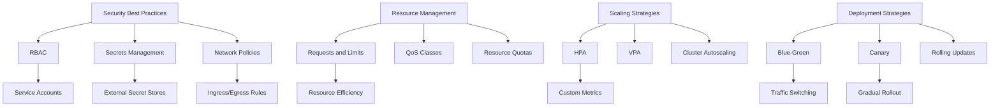

# Chapter 6: Best Practices and Scaling

## Introduction

In this final chapter, we'll explore best practices for running production-ready applications on Kubernetes and techniques for scaling your applications effectively. We'll cover security, monitoring, resource optimization, and strategies for handling increased load.

## Security Best Practices

### RBAC (Role-Based Access Control)

RBAC allows you to control access to Kubernetes resources based on roles and permissions. It's essential for securing your cluster.

#### Creating Service Accounts

Instead of using default service accounts, create dedicated ones for your applications:

```yaml
apiVersion: v1
kind: ServiceAccount
metadata:
  name: app-service-account
  namespace: default
```

#### Creating Roles and RoleBindings

Define minimal permissions needed for your application:

```yaml
apiVersion: rbac.authorization.k8s.io/v1
kind: Role
metadata:
  namespace: default
  name: pod-reader
rules:
- apiGroups: [""]
  resources: ["pods"]
  verbs: ["get", "watch", "list"]
---
apiVersion: rbac.authorization.k8s.io/v1
kind: RoleBinding
metadata:
  name: read-pods
  namespace: default
subjects:
- kind: ServiceAccount
  name: app-service-account
  apiGroup: ""
roleRef:
  kind: Role
  name: pod-reader
  apiGroup: ""
```

### Secrets Management

Never store sensitive information in plain text. Use Kubernetes Secrets or external secret management tools.

#### Creating Secrets

```bash
# From literal values
kubectl create secret generic db-credentials \
  --from-literal=username=myuser \
  --from-literal=password=mypassword
```

```yaml
# From YAML
apiVersion: v1
kind: Secret
metadata:
  name: db-credentials
type: Opaque
data:
  username: <base64-encoded-username>
  password: <base64-encoded-password>
```

#### Using Secrets in Deployments

```yaml
spec:
  containers:
  - name: app-container
    env:
    - name: DB_USERNAME
      valueFrom:
        secretKeyRef:
          name: db-credentials
          key: username
    - name: DB_PASSWORD
      valueFrom:
        secretKeyRef:
          name: db-credentials
          key: password
```

### Network Policies

Network policies allow you to control traffic flow between Pods in your cluster.

```yaml
apiVersion: networking.k8s.io/v1
kind: NetworkPolicy
metadata:
  name: app-network-policy
spec:
  podSelector:
    matchLabels:
      app: hello-k8s-app
  policyTypes:
  - Ingress
  - Egress
  ingress:
  - from:
    - podSelector:
        matchLabels:
          app: frontend
    ports:
    - protocol: TCP
      port: 8080
  egress:
  - to:
    - namespaceSelector:
        matchLabels:
          name: database
    ports:
    - protocol: TCP
      port: 5432
```

## Resource Management and Optimization

### Requests and Limits

Properly setting resource requests and limits is crucial for cluster stability and efficient resource utilization.

```yaml
spec:
  containers:
  - name: app-container
    resources:
      requests:
        memory: "64Mi"    # Minimum guaranteed resources
        cpu: "250m"
      limits:
        memory: "128Mi"   # Maximum allowed resources
        cpu: "500m"
```

### Quality of Service (QoS) Classes

Kubernetes assigns QoS classes based on resource settings:
- **Guaranteed**: Limits and requests are equal for all resources
- **Burstable**: Limits and requests differ for some resources
- **BestEffort**: No limits or requests specified

### Resource Quotas

Limit resource consumption per namespace:

```yaml
apiVersion: v1
kind: ResourceQuota
metadata:
  name: compute-quota
  namespace: default
spec:
  hard:
    requests.cpu: "4"
    requests.memory: "8Gi"
    limits.cpu: "8"
    limits.memory: "16Gi"
```

## Scaling Strategies

### Vertical Pod Autoscaling (VPA)

VPA automatically adjusts resource requests and limits based on usage:

```yaml
apiVersion: autoscaling.k8s.io/v1
kind: VerticalPodAutoscaler
metadata:
  name: app-vpa
spec:
  targetRef:
    apiVersion: apps/v1
    kind: Deployment
    name: hello-k8s-app
  updatePolicy:
    updateMode: "Auto"
```

### Horizontal Pod Autoscaling (HPA)

HPA scales the number of Pods based on CPU utilization or custom metrics:

```yaml
apiVersion: autoscaling/v2
kind: HorizontalPodAutoscaler
metadata:
  name: app-hpa
spec:
  scaleTargetRef:
    apiVersion: apps/v1
    kind: Deployment
    name: hello-k8s-app
  minReplicas: 2
  maxReplicas: 10
  metrics:
  - type: Resource
    resource:
      name: cpu
      target:
        type: Utilization
        averageUtilization: 70
```

### Cluster Autoscaling

Cluster autoscaling automatically adjusts the size of your node pool based on resource demands:

```yaml
# This is typically configured at the cloud provider level
# Example for GKE:
# gcloud container clusters update my-cluster --enable-autoscaling \
#     --min-nodes=1 --max-nodes=10 --zone=us-central1-a
```

## Monitoring and Observability

### Metrics Collection with Prometheus

Prometheus is a popular monitoring solution for Kubernetes:

```yaml
apiVersion: monitoring.coreos.com/v1
kind: ServiceMonitor
metadata:
  name: app-metrics
spec:
  selector:
    matchLabels:
      app: hello-k8s-app
  endpoints:
  - port: metrics
    interval: 30s
```

### Logging Best Practices

- Use structured logging (JSON format)
- Include relevant metadata (request ID, user ID, etc.)
- Use standard log levels (DEBUG, INFO, WARN, ERROR)

Example of structured logging in an application:
```javascript
console.log(JSON.stringify({
  level: 'info',
  timestamp: new Date().toISOString(),
  message: 'Request processed',
  requestId: 'abc-123',
  userId: 'user-456',
  duration: 150
}));
```

### Distributed Tracing

Use tools like Jaeger or Zipkin for distributed tracing across microservices.

## Deployment Strategies

### Blue-Green Deployment

Deploy a new version alongside the old version, then switch traffic:

```bash
# Deploy new version with different label
kubectl apply -f new-version.yaml

# Verify new version works
# Switch traffic by updating service selector
kubectl patch service hello-k8s-service -p '{"spec":{"selector":{"version":"v2.0"}}}'

# Remove old version after confirmation
kubectl delete deployment hello-k8s-app-v1
```

### Canary Deployment

Gradually roll out a new version to a subset of users:

```yaml
# Deploy new version with canary label
apiVersion: apps/v1
kind: Deployment
metadata:
  name: hello-k8s-app-canary
spec:
  replicas: 1  # Only 1 out of 4 total replicas
  selector:
    matchLabels:
      app: hello-k8s-app
      version: canary
  template:
    metadata:
      labels:
        app: hello-k8s-app
        version: canary
    spec:
      containers:
      - name: hello-k8s-container
        image: hello-k8s-app:v2.0
```

### Rolling Updates

The default deployment strategy that gradually replaces old Pods with new ones:

```yaml
spec:
  strategy:
    type: RollingUpdate
    rollingUpdate:
      maxUnavailable: 1      # Max Pods unavailable during update
      maxSurge: 1           # Max extra Pods during update
```

## Performance Optimization

### Pod Disruption Budgets

Ensure high availability during voluntary disruptions:

```yaml
apiVersion: policy/v1
kind: PodDisruptionBudget
metadata:
  name: app-pdb
spec:
  minAvailable: 2
  selector:
    matchLabels:
      app: hello-k8s-app
```

### Node Affinity and Anti-Affinity

Control where Pods are scheduled:

```yaml
spec:
  affinity:
    nodeAffinity:
      requiredDuringSchedulingIgnoredDuringExecution:
        nodeSelectorTerms:
        - matchExpressions:
          - key: disktype
            operator: In
            values:
            - ssd
    podAntiAffinity:
      preferredDuringSchedulingIgnoredDuringExecution:
      - weight: 100
        podAffinityTerm:
          labelSelector:
            matchExpressions:
            - key: app
              operator: In
              values:
              - hello-k8s-app
          topologyKey: kubernetes.io/hostname
```

### Resource Efficiency

- Use appropriate resource requests and limits
- Implement graceful shutdown to avoid connection drops
- Use init containers for setup tasks
- Leverage container image optimization techniques

## Future-Proofing Your Applications

### API Versioning

Use stable API versions in your manifests:

```yaml
# Good - uses stable API version
apiVersion: apps/v1
kind: Deployment

# Avoid - uses deprecated API version
apiVersion: extensions/v1beta1
kind: Deployment
```

### Helm for Package Management

Helm packages Kubernetes manifests into charts for easier management:

```yaml
# Chart.yaml
apiVersion: v2
name: hello-k8s-app
description: A Helm chart for the Hello K8s application
type: application
version: 0.1.0
appVersion: "1.0.0"
```

### GitOps for Deployment

Use GitOps tools like ArgoCD or Flux to manage your deployments declaratively:

```yaml
apiVersion: argoproj.io/v1alpha1
kind: Application
metadata:
  name: hello-k8s-app
  namespace: argocd
spec:
  project: default
  source:
    repoURL: https://github.com/your-org/hello-k8s-app
    targetRevision: HEAD
    path: k8s/overlays/production
  destination:
    server: https://kubernetes.default.svc
    namespace: production
```

## Summary

In this chapter, we've covered essential best practices and scaling techniques for production Kubernetes deployments:

- Security: RBAC, Secrets management, Network policies
- Resource management: Requests/limits, QoS classes, Resource quotas
- Scaling: VPA, HPA, Cluster autoscaling
- Observability: Monitoring, logging, distributed tracing
- Deployment strategies: Blue-green, Canary, Rolling updates
- Performance optimization: PDBs, Affinity rules, Resource efficiency
- Future-proofing: API versioning, Helm, GitOps

These practices will help you run stable, secure, and efficient applications on Kubernetes. Remember that Kubernetes is a complex system, and it's important to continuously learn and adapt to new features and best practices.

Congratulations! You've completed the Kubernetes for Absolute Beginners textbook. You now have the foundational knowledge to work with Kubernetes effectively. Continue practicing with different applications and scenarios to deepen your understanding.

### Quiz

1. What is the difference between a ResourceQuota and a LimitRange?
2. Name three deployment strategies in Kubernetes.
3. What is the purpose of a Pod Disruption Budget?

